#  Hybrid Production Incident Response (AWS + Linux)

---

##  Objective

This walkthrough documents a simulated production incident in a cloud-hosted Linux environment where high CPU utilization degraded application performance.

The objective was to investigate, identify root cause, restore service, and validate system recovery using a structured incident response lifecycle.

---

##  Environment

- AWS EC2 (Amazon Linux 2023)
- Nginx web server
- SSH remote access
- Python automation script

---

##  Incident Response Lifecycle

Alert → Investigation → Isolation → Root Cause → Resolution → Validation → Prevention

---

#  PHASE 1 — ENVIRONMENT SETUP

## Step 1 — Launch EC2 Instance (AWS Console)

- Instance Type: `t2.micro` (Free Tier)
- OS: Amazon Linux 2023
- Security Group:
  - SSH (22) → My IP
  - HTTP (80) → Anywhere

 **Screenshot**
- EC2 instance in “Running” state
- Public IP visible

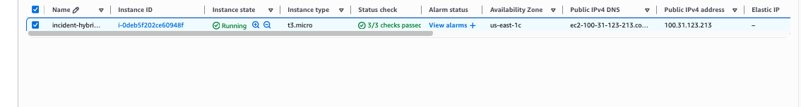


---

## Step 2 — Connect via SSH (FROM MAC TERMINAL)

bash
ssh -i ~/Downloads/incident-key.pem ec2-user@<PUBLIC-IP>

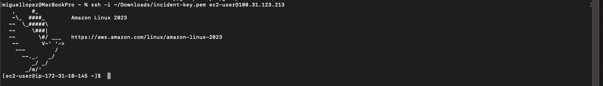


## Step 3 — Verify OS (CONFIRM AMAZON LINUX)
cat /etc/os-release

#### Screenshot

Output shows Amazon Linux 2023


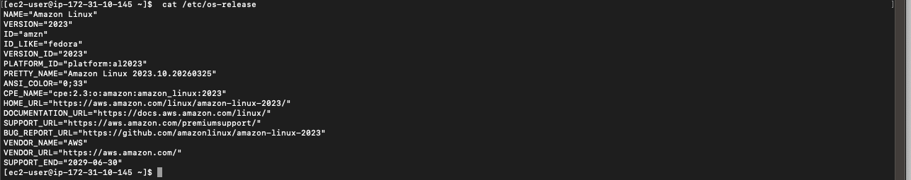

#### Verify you are inside Linux

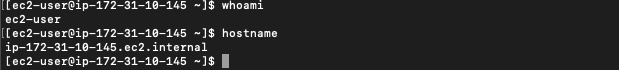

## Step 4 — Update System
sudo dnf update -y

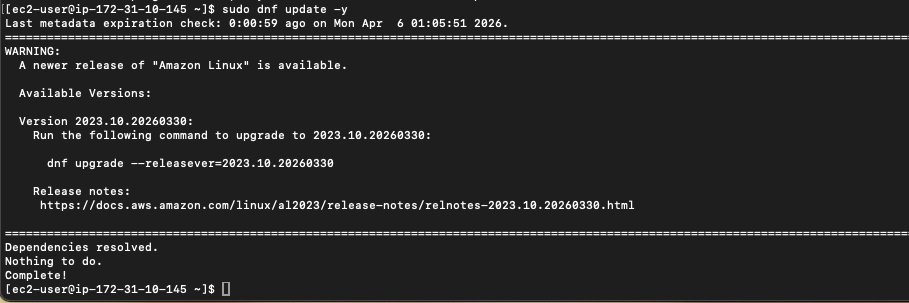

## Step 5 — Install Nginx

sudo dnf install nginx -y

#### Screenshot
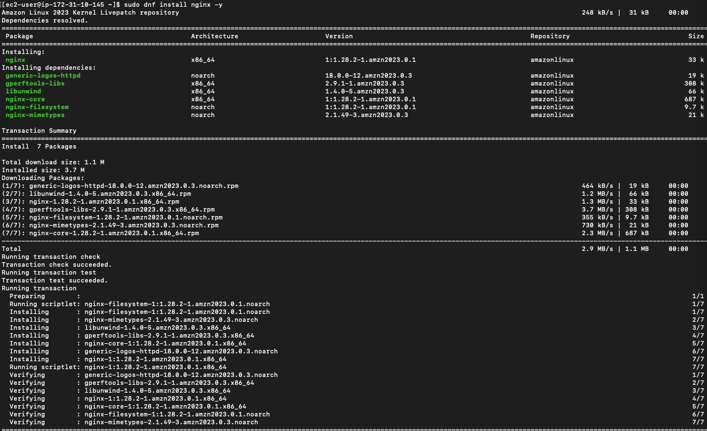


## Step 6 — Start and Enable Nginx

sudo systemctl start nginx

sudo systemctl enable nginx


## Step 7 — Deploy Custom Web Page

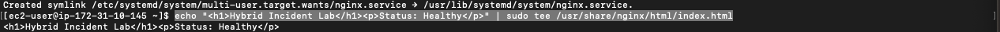

sudo systemctl restart nginx:

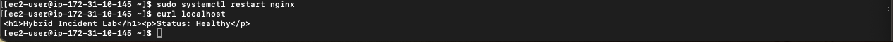

## Step 8 — Validate Application

curl localhost

Open browser:

(http://100.31.123.213)


Webpage loading successfully

🎊🎊🎊

# PHASE 2 — BASELINE VALIDATION

## Step 1 — Confirm Service Status

systemctl status nginx

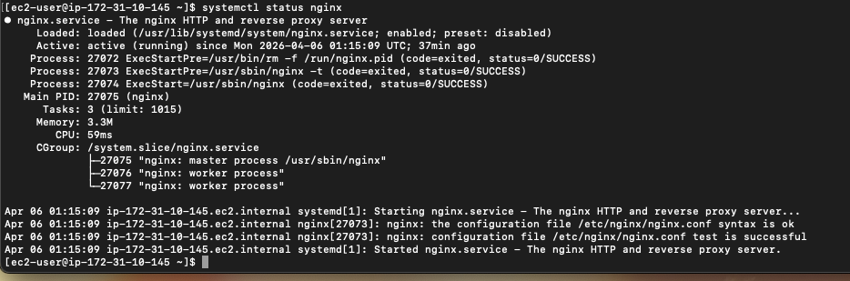

## Step 2 — Confirm Port Listening

ss -tulnp | grep :80

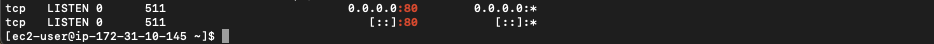

## Step 3 — Confirm Application Response

curl localhost

 Screenshot
 


nginx active
port 80 listening


# PHASE 3 — INCIDENT SIMULATION

## Step 1 — Simulate High CPU Condition
yes > /dev/null &
yes > /dev/null &

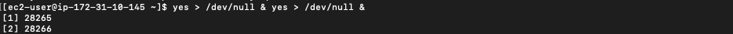

This creates runaway processes consuming CPU resources.

# PHASE 4 — INVESTIGATION

## Step 1 — Analyze CPU Usage

top

High CPU usage visible
yes processes consuming CPU

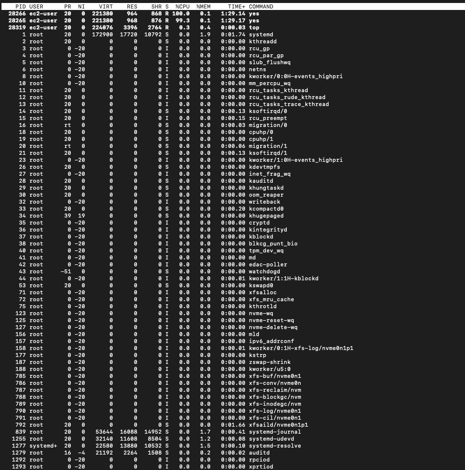


## Step 2 — Identify Resource-Intensive Processes

ps aux --sort=-%cpu | head -10


yes process at top

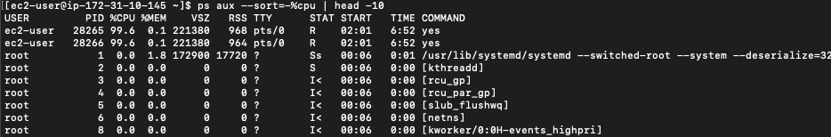

## Step 3 — Check Service Status

systemctl status nginx

nginx status output:

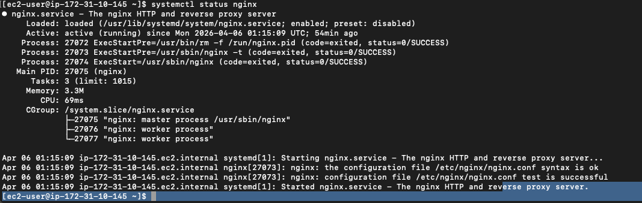

## Step 4 — Review Logs

journalctl -u nginx --no-pager | tail -20

Screenshot

log output

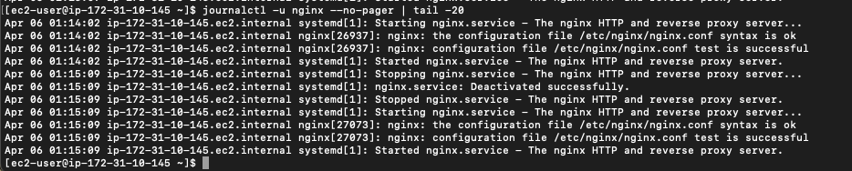

## Step 5 — Test Application Performance

curl -I http://localhost
time curl http://localhost

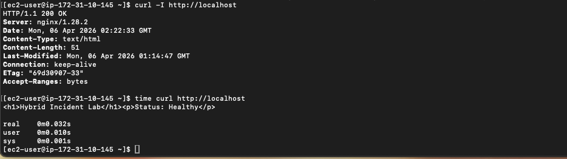

# 🧠 PHASE 5 — ROOT CAUSE ANALYSIS

The system experienced high CPU utilization caused by a runaway yes process.

This resulted in resource exhaustion, degrading overall system performance and impacting nginx responsiveness.

# PHASE 6 — RESOLUTION

## Step 1 — Terminate Rogue Process

pkill yes

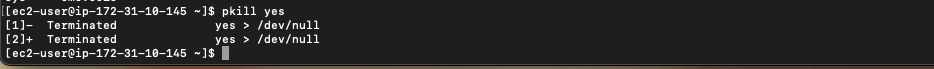

## Step 2 — Restart Service

sudo systemctl restart nginx

 ## PHASE 7 — VALIDATION
 
Step 1 — Confirm CPU Normalization

top

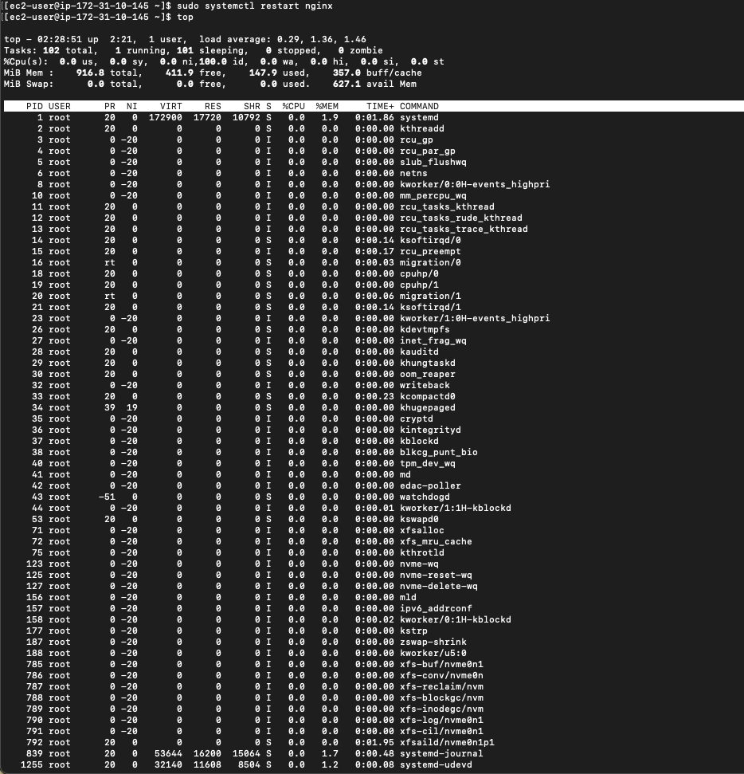

## Step 2 — Confirm Service Status

systemctl status nginx

## Step 3 — Confirm Port Listening

ss -tulnp | grep :80

## Step 4 — Confirm Application Response

curl http://localhost

CPU normal
nginx active

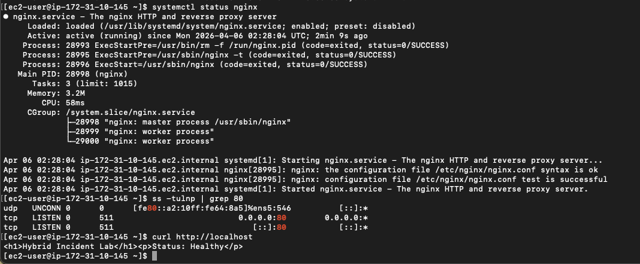


Webpage working again


# 🐍 PHASE 8 — AUTOMATION

## Step 1 — Install Python

check if installed python3 --version  or sudo dnf install python3 -y if not 

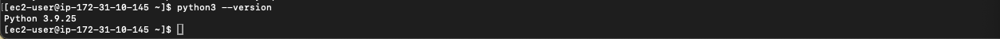


## Step 2 — Create Monitoring Script

nano check_nginx.py

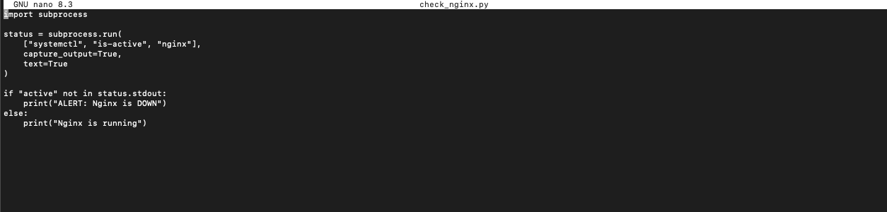

* opens the nano text editor
* creates a new file named check_nginx.py

###### Python scripts to run
```
import subprocess

status = subprocess.run(
    ["systemctl", "is-active", "nginx"],
    capture_output=True,
    text=True
)

if "active" not in status.stdout:
    print("ALERT: Nginx is DOWN")
else:
    print("Nginx is running")

```

##### What this code does:

imports Python’s subprocess module so Python can run Linux commands
runs systemctl is-active nginx
captures the output
checks whether the word active is present
prints either:
Nginx is running
or ALERT: Nginx is DOWN

## Step 3 — Run Script

python3 check_nginx.py

Screenshot

Output: Nginx is running

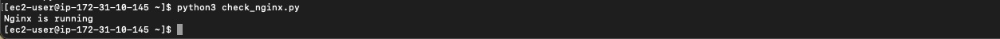

## Step 4 — Simulate Detection

sudo systemctl stop nginx
python3 check_nginx.py

 Screenshot

Output: ALERT: Nginx is DOWN

Save as:

screenshots/12-python-alert.png


## Step 5 — Restore Service
sudo systemctl start nginx

# 📣 PHASE 9 — COMMUNICATION

Incident Timeline
14:00 – Alert triggered (high CPU)
14:02 – Investigation initiated
14:04 – High CPU identified via top
14:06 – Rogue process identified
14:08 – Process terminated
14:09 – nginx restarted
14:10 – Service restored

## Bridge Call Summary

The application degradation was caused by high CPU utilization due to a runaway process.

The process has been terminated and nginx service restarted.

The system has been validated and is now operating normally.

### Prevention Plan
Implement CPU monitoring alerts (CloudWatch)
Introduce automated service health checks
Monitor process-level resource usage
Establish incident response runbooks

###  Skills Demonstrated
Linux troubleshooting (top, ps, systemctl)
Log analysis (journalctl)
Network validation (ss, curl)
AWS EC2 management
Incident response lifecycle
Root cause analysis (RCA)
Python automation
